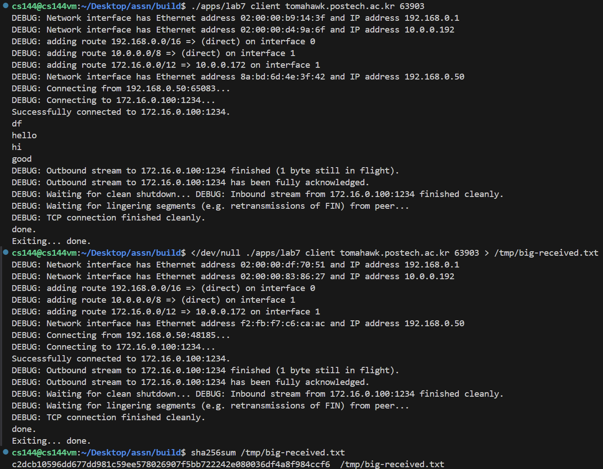

Assignment 7 Writeup
=============

My POVIS ID: khkim6040

My student ID (numeric): 20190650

My assignment partner's name: Goh Jinmin

My assignment partner's POVIS ID: eric9709

My assignment partner's ID (numeric): 20160074

This assignment took me about 1 hours to do (including the time on studying, designing, and writing the code).

If you used any part of best-submission codes, specify all the best-submission numbers that you used (e.g., 1, 2): []

- **Caution**: If you have no idea about above best-submission item, please refer the Assignment PDF for detailed description.

Solo portion:
- My implementation successfully started and end a conversation with another copy of itself.
- I successfully transfered a one-megabyte file, with contents identical upon receipt.
- I didn't change any code.

Group portion:
- Our implementations successfully started and end a conversation with each other.

- We successfully transfer a one-megabyte file between your two implementations, with contents identical upon receipt.

Creative portion (optional):
[]

Other remarks:
[]

- Optional: I had unexpected difficulty with: [describe]

- Optional: I think you could make this assignment better by: [describe]

- Optional: I was surprised by: [describe]

- Optional: I'm not sure about: [describe]
